# Pura Vida: Your Oasis for Indoor Plants in Ireland

Welcome to Pura Vida – your ultimate destination for bringing the beauty of nature into your home with our exquisite collection of indoor plants. Our mission is to make it easy for plant enthusiasts across Ireland to access a curated selection of high-quality indoor plants, transforming living spaces into vibrant, green sanctuaries.


## Project Overview

Pura Vida is not just an online store; it's a botanical experience tailored for plant lovers who appreciate the positive impact of greenery on their well-being. We aim to simplify the process of selecting and purchasing indoor plants by offering a seamless online platform. Whether you're a seasoned plant parent or a first-time buyer, Pura Vida is designed to cater to your needs.

### Target Audience

Our platform is crafted for individuals and households in Ireland seeking to enhance their indoor environment with the natural beauty of plants. From urban dwellers with limited outdoor space to those looking to add a touch of tranquility to their homes, Pura Vida is the go-to source for premium indoor plants.

# Features

## Navigation Bar

Our fully responsive navigation bar ensures easy exploration, providing quick access to essential sections like:
- **Shop All Plants:** Explore our diverse collection effortlessly.
- **Shop by Category:** Find plants based on specific categories.
- **Shop Plants by Price Range:** Filter plants based on your budget.
- **Search (Offcanvas):** Conduct targeted searches with our convenient offcanvas search feature.
- **Wishlist (Heart Icon):** Registered users can curate their wishlists with a simple click.
- **User Account (Person Icon):** Access your account with ease, providing links for login or registration.
- **Shopping Bag (Bag Icon):** Directly navigate to your shopping bag, displaying the current item count.


## Hero Section

Our captivating hero image features a joyous individual holding a plant, accompanied by the text "The Largest Indoor Plants Selection in Ireland." Take action with:
- **Shop Now Button:** Directs users to a product page for immediate exploration.
- **Get 20% Off Button:** Sign up for our newsletter and receive a discount coupon via email.


## Login and Register Pages

Seamlessly access your account through our dedicated login and register pages, ensuring a personalized and secure experience.
<div style="display: flex; justify-content: space-between;">
  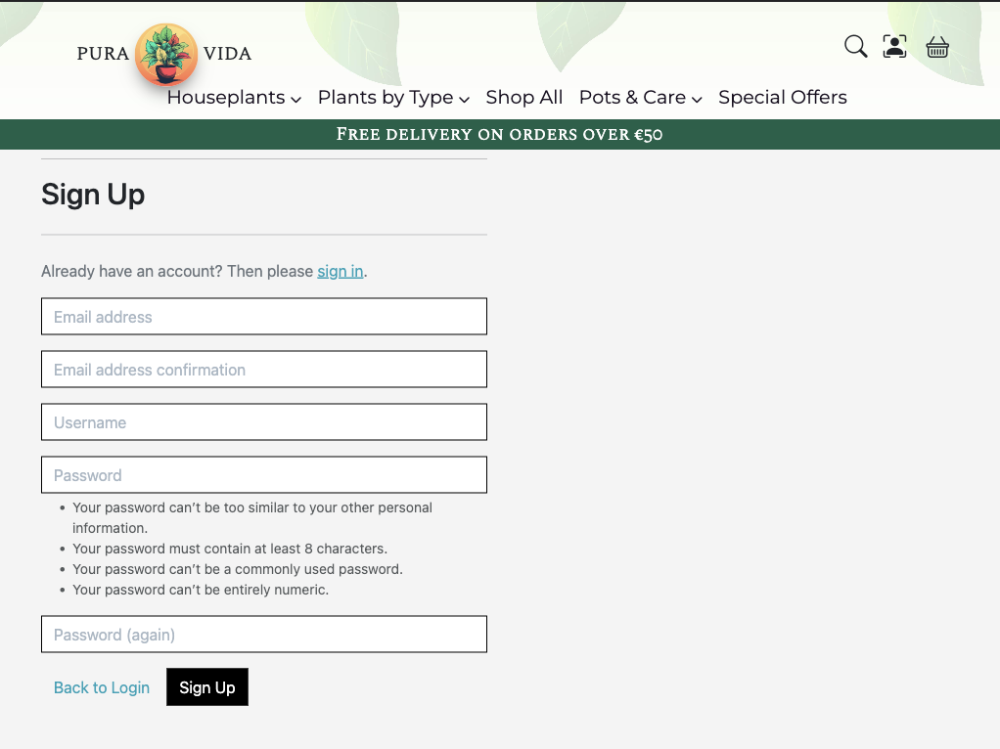
  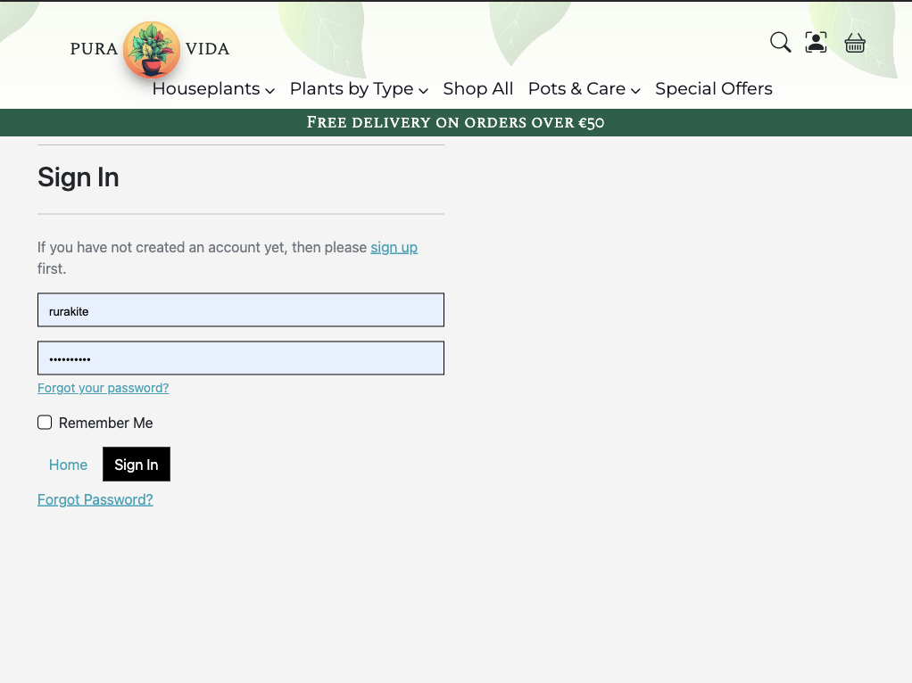
</div>

## Best selling products Section

Our Best Selling Products Section showcases the plant companions that have won the hearts of our customers and have the highest rating.


## Testimonials Section

Read about the positive shopping experiences of our clients in our testimonials section, providing insight into the quality of our products and services.


## Footer

Our footer is a valuable resource, featuring:
- **Social Media Links:** Stay connected and engaged with us on facebook platform.
- **Helpful Links:** Easy access to important pages and resources.


## Products Page

### Filtering and Sorting

Explore our products effortlessly with:
- **Filtering:** Choose plants based on specific categories, watering needs, and lighting requirements.
- **Sorting:** Arrange items alphabetically or by price for a customized browsing experience.
- **Back to Top Button:** Effortlessly return to the top of the page for convenient navigation.

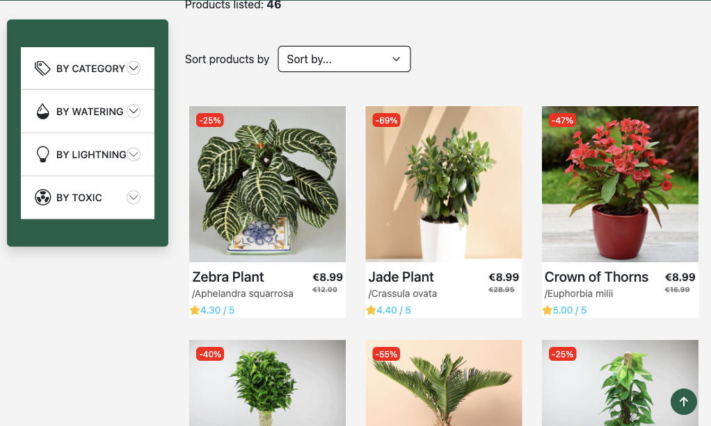

## Product Details Page

Delve into product details with a comprehensive page featuring:
- **Large Product Image:** Visualize your chosen plant in detail.
- **Rating and Price Display:** Quickly assess the product's popularity and cost.
- **Quantity Input:** Easily adjust the quantity before adding items to your bag.
- **Review and Rating:** Share your thoughts and experiences by leaving reviews and ratings.

<div style="display: flex; justify-content: space-between;">
  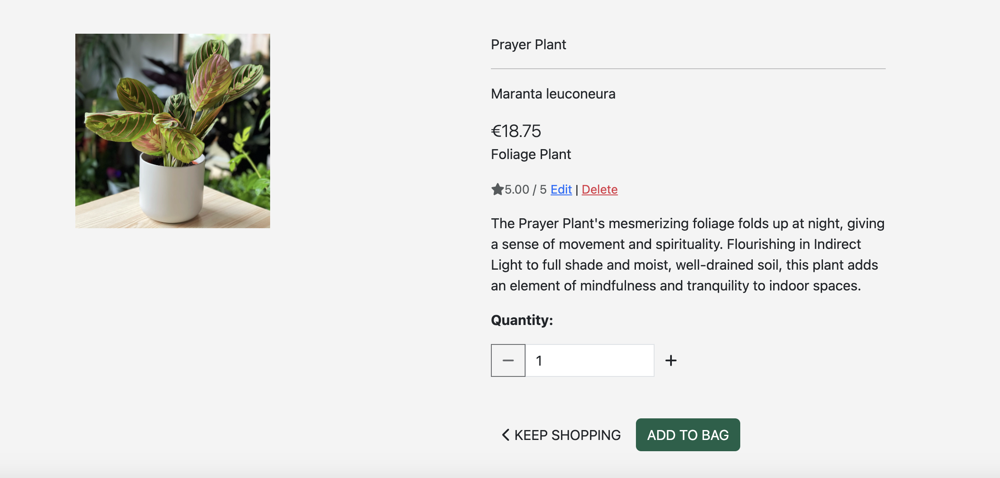
  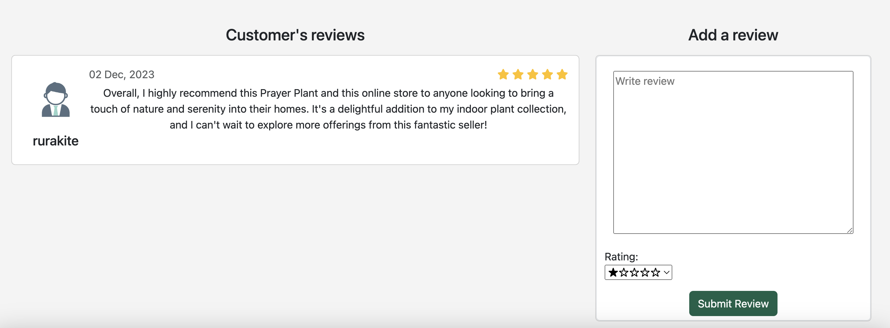
</div>

## Wishlist Page

Curate your personalized wishlist with ease, where you can:
- **Add to Bag:** Move wishlist items directly to your shopping bag.
- **Remove from Wishlist:** Streamline your wishlist as preferences evolve.

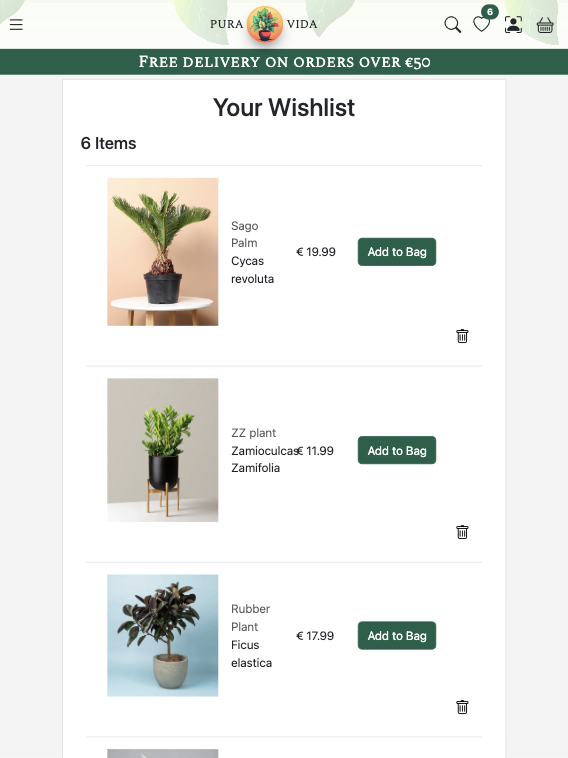

## Bag Page

The bag page offers a detailed overview:
- **Interactive Progress Bar:** Track your spending and progress towards free shipping.
- **Checkout Button:** Effortlessly proceed to checkout for a seamless shopping experience.

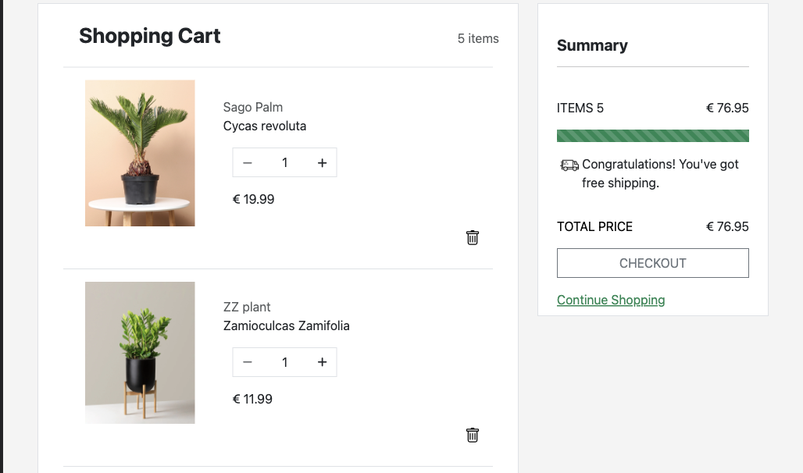

## Checkout Page

Complete your purchase with confidence:
- **Final Calculations:** Review your order details, including costs and discounts.
- **Discount Coupon Application:** Enter your discount coupon for additional savings.
- **Shipping and Billing Form:** Provide essential details for a smooth checkout process.

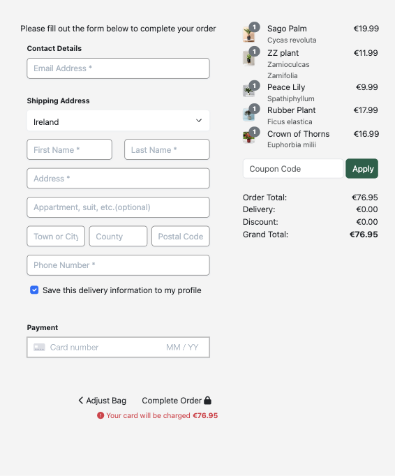

## Profile Page

Manage your account efficiently with access to:
- **Order History:** Track your past purchases for reference.
- **Address Update:** Easily update your shipping address for convenience.

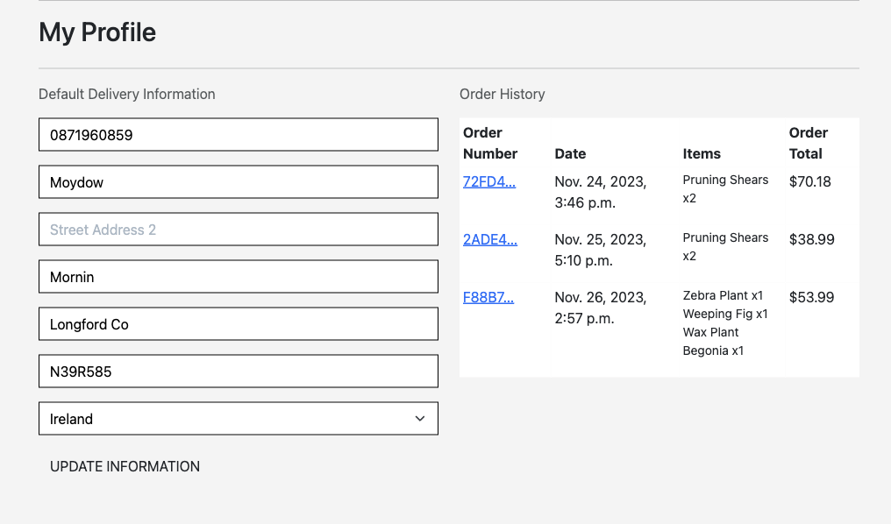

## Security and Permissions

We prioritize the security of your online store. Our system ensures that only authorized personnel with admin or superuser privileges can access the product management features. This guarantees the integrity of your product data and prevents any unauthorized changes. Manager can add, edit and delet products with just a few clicks.

## Custom 404 Page

In the event of a non-existent page, our custom 404 page ensures a user-friendly experience with a direct link back to the home page.

Explore our website confidently, and thank you for choosing us as your indoor plant destination!


## Features Left to Implement

* Adding messages to a purchase.
* Special offer page.
* Breadcrumbs.
* Products suggestions.

# Agile Overview

## Milestones

### 1. **Viewing and Navigation**

#### Epic: Viewing and Navigation
1. **Story:** Easily navigate the website to explore and select items for purchase.
2. **Story:** View individual product details, including price, description, rating, image, and available sizes.
3. **Story:** Quickly identify deals and special offers for potential savings.
4. **Story:** Easily view the total of purchases at any time to avoid overspending.
5. **Story:** Browse various gift categories for different occasions.
6. **Story:** Find quick answers in the FAQ section to resolve queries efficiently.
7. **Story:** Subscribe to newsletters for updates and special offers.
8. **Story:** Access customer reviews to build trust in products.

### 2. **Sorting and Searching**

#### Epic: Sorting and Searching
9. **Story:** Sort available products to identify the best-rated, best-priced, and categorically sorted items.
10. **Story:** Sort a specific category or product by name to find the best-priced or best-rated.
11. **Story:** Simultaneously sort multiple categories for broad product comparisons.
12. **Story:** Search for a product by name or description to find specific items.
13. **Story:** Easily review search results and their quantity.

### 3. **Registration and User Accounts**

#### Epic: Registration and User Accounts
14. **Story:** Easily register for an account to access a personal account and view the profile.
15. **Story:** Conveniently log in or log out to manage personal account information.
16. **Story:** Recover a forgotten password for account access.
17. **Story:** Receive an email confirmation after registering for a successful account creation.
18. **Story:** Option to create a user account for easier future purchases and order tracking.

### 4. **Purchasing and Checkout**

#### Epic: Purchasing and Checkout
19. **Story:** Easily select the size and quantity of a product during purchase.
20. **Story:** View items in the shopping bag to identify the total cost and items to be received.
21. **Story:** Add items to the shopping bag, view it anytime, and keep track of selections.
22. **Story:** Adjust the quantity of individual items in the bag before checkout.
23. **Story:** Experience a smooth and secure checkout process.
24. **Story:** Ensure personal and payment information security during checkout.
25. **Story:** View an order confirmation after checkout to verify details.
26. **Story:** Include a personalized message or note during checkout.
27. **Story:** Choose a delivery date and address during checkout for timely delivery.
28. **Story:** Receive an order confirmation via email for record-keeping.

### 5. **Admin and Store Management**

#### Epic: Admin and Store Management
29. **Story:** Easily add a product to the store.
30. **Story:** Edit/update a product to modify prices, descriptions, images, and other criteria.
31. **Story:** Delete a product to remove items no longer for sale.
32. **Story:** Easily update product availability, pricing, and personalization details.

### 6. **Deployment and Documentation**

#### Epic: Deployment
33. **Story:** Deploy the Pura Vida web app to a production environment.
34. **Story:** Ensure proper server configuration and implement security measures.
35. **Story:** Ensure cross-device and cross-browser accessibility for users.

#### Epic: Documentation
36. **Story:** Complete README documentation for comprehensive information about the Pura Vida app.

## Agile Planning Tools
- **Epics:** Grouped into major project objectives.
- **Stories:** Represent specific features or functionalities within each epic.
- **Kanban board:** Helps to visually manage and track the progress of tasks and user stories throughout the development process. The board provides a clear representation of the project's status, from backlog to completion.

    1. Backlog: Place user stories and tasks here as they are identified.
    2. To-Do: Move tasks that are ready for development to this column.
    3. In Progress:Tasks currently being worked on by developers.
    4. Done: Tasks that have been completed and reviewed.

    <div style="display: flex; justify-content: space-between;">
    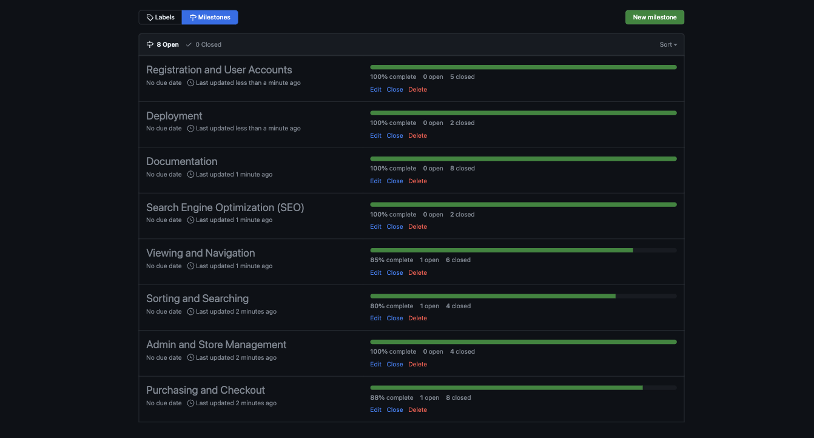
    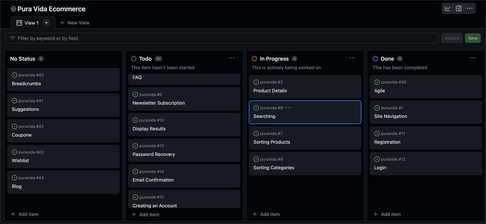
    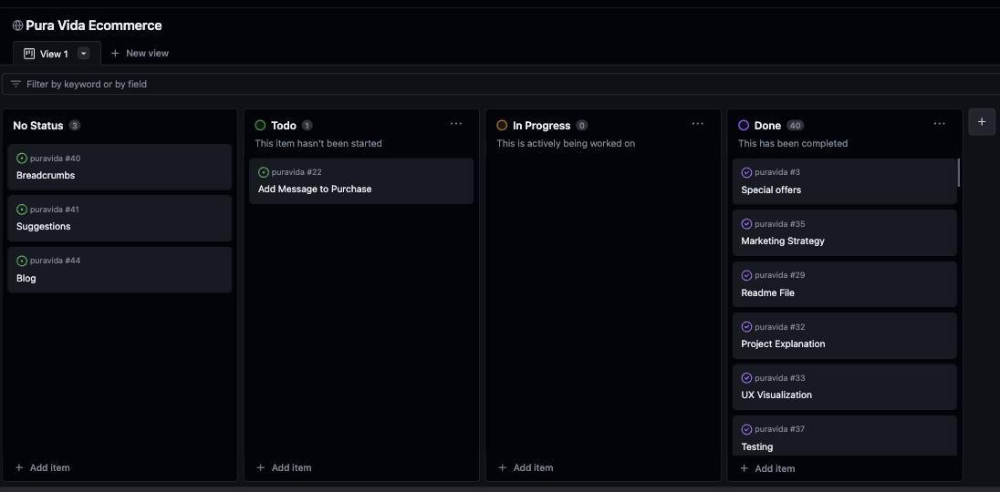
    </div>

# Technologies Used

The Pura Vida website leverages a variety of technologies to deliver a robust and user-friendly experience. Here's an overview of the key technologies employed in the development:

## Frontend Technologies

### 1. **HTML**

- HTML serves as the foundational language for organizing and defining the structure of the website.

### 2. **Bootstrap**

- Bootstrap is utilized for its responsive features, enabling the website to seamlessly adapt to different screen sizes and devices, thereby ensuring an optimal user experience.

### 3. **CSS**

- Custom CSS style rules are applied to achieve a unique and cohesive design, aligning with the overall visual concept of the application.

### 4. **JavaScript**

- JavaScript is employed for real-time updates of bag items and wishlist items, enhancing the user experience. Additionally, it facilitates the integration of Stripe elements for secure and seamless payment processing.

### 5. **Font Awesome**

- Font Awesome is integrated to provide a comprehensive library of scalable vector icons, contributing to the visual appeal and aesthetics of the website.

## Backend Technologies

### 5. **Python (Django Framework)**

- Python, coupled with the Django Framework, serves as the primary programming language for the application. Django provides a robust and scalable foundation for backend development.

### 6. **Django ORM**

- Django's Object-Relational Mapping (ORM) is utilized to fetch data and provide advanced search and filtering functionalities, enhancing the overall efficiency of data retrieval.

### 7. **Stripe**

- Stripe is integrated into the website for secure and efficient payment processing, ensuring a seamless checkout experience for users.

## Cloud Services

### 8. **AWS**

- Amazon Web Services (AWS) is employed to harness cloud computing capabilities, contributing to the scalability and reliability of the application.

## Development Tools

### 9. **VS Code IDE**

- Visual Studio Code is utilized for the development of the website, providing an efficient coding environment.

### 10. **GitHub**

- The source code is hosted on GitHub, facilitating version control, collaboration, and code management.

### 11. **Git**

- Git is used for version control, allowing developers to commit and push code during the website's development.

## Additional Libraries

### 12. **Bootstrap Icons**

- Bootstrap Icons are integrated to enhance the visual elements of the site, providing a collection of scalable vector icons.

This technology stack collectively contributes to the functionality, aesthetics, and performance of the Pura Vida website.

## Entities

### Order

- **id (Primary Key):** Unique identifier for each order.
- **order_number:** A string representing the order number.
- **user_profile (Foreign Key):** References the UserProfile entity, linking the order to a specific user profile.
- **coupon (Foreign Key):** References the Coupon entity, providing information about applied discounts.
- **date:** Timestamp indicating the date and time when the order was placed.
- **delivery_cost:** Decimal field representing the cost of delivery.
- **order_total:** Decimal field indicating the total cost of the order.
- **grand_total:** Decimal field representing the grand total, including discounts and additional costs.
- **original_bag:** Text field storing the original bag contents.
- **stripe_pid:** A string representing the Stripe payment ID.
- **discount:** Decimal field representing the applied discount.

### OrderLineItem

- **id (Primary Key):** Unique identifier for each order line item.
- **order (Foreign Key):** References the Order entity, connecting the line item to a specific order.
- **product (Foreign Key):** References the Product entity, indicating the associated product.
- **product_size:** A string representing the size of the product.
- **quantity:** Integer field indicating the quantity of the product in the order.
- **lineitem_total:** Decimal field representing the total cost of the line item.

### Coupon

- **id (Primary Key):** Unique identifier for each coupon.
- **code:** A string representing the coupon code.
- **valid_from:** Timestamp indicating when the coupon becomes valid.
- **valid_to:** Timestamp indicating the expiration date of the coupon.
- **discount:** Integer field representing the discount percentage.
- **validators:** Integer field indicating the number of times the coupon can be used.
- **active:** Boolean field determining the coupon's active status.

### Subscribers

- **id (Primary Key):** Unique identifier for each subscriber.
- **email:** Email field representing the email address of the subscriber.
- **date:** Timestamp indicating the date when the subscription was initiated.

### MailMessage

- **id (Primary Key):** Unique identifier for each mail message.
- **title:** A string representing the title of the message.
- **message:** Text field containing the content of the message.

### Category

- **id (Primary Key):** Unique identifier for each category.
- **name:** A string representing the name of the category.
- **friendly_name:** A string providing a user-friendly name for the category.

### Product

- **id (Primary Key):** Unique identifier for each product.
- **sku:** A string representing the stock keeping unit of the product.
- **name:** A string representing the name of the product.
- **botanical_name:** A string representing the botanical name of the plant.
- **category (Foreign Key):** References the Category entity, indicating the category to which the product belongs.
- **description:** Text field containing a detailed description of the product.
- **size:** A string representing the size of the product.
- **price:** Decimal field indicating the original price of the product.
- **discount_price:** Decimal field indicating the discounted price of the product.
- **rating:** Decimal field representing the average rating of the product.
- **preferred_light:** A string indicating the preferred light conditions for the plant.
- **watering_needs:** A string indicating the watering needs of the plant.
- **toxic:** Boolean field indicating whether the plant is toxic.
- **date:** Date field indicating when the product was added to the inventory.
- **image:** Image field representing the image of the product.

### UserProfile

- **id (Primary Key):** Unique identifier for each user profile.
- **user (One-to-One relationship):** References the User entity, establishing a one-to-one relationship.
- **default_phone_number:** A string representing the default phone number for the user.
- **default_street_address1:** A string representing the first line of the default street address.
- **default_street_address2:** A string representing the second line of the default street address.
- **default_town_or_city:** A string representing the default town or city for the user.
- **default_county:** A string representing the default county for the user.
- **default_postcode:** A string representing the default postcode for the user.
- **default_country:** A CountryField representing the default country for the user.

### ProductReview

- **id (Primary Key):** Unique identifier for each product review.
- **user (Foreign Key):** References the User entity, indicating the user who wrote the review.
- **product (Foreign Key):** References the Product entity, indicating the product being reviewed.
- **review:** Text field containing the content of the review.
- **rating:** Integer field representing the rating given by the user.
- **date:** Timestamp indicating the date when the review was submitted.

### Wishlist

- **id (Primary Key):** Unique identifier for each wishlist.
- **user (Foreign Key):** References the User entity, indicating the user who created the wishlist.
- **product (Foreign Key):** References the Product entity, indicating the product added to the wishlist.
- **date:** Timestamp indicating when the product was added to the wishlist.

### User

- **id (Primary Key):** Unique identifier for each user.
- **username:** A string representing the username of the user.
- **password:** A string representing the password of the user.
- **email:** Email field representing the email address of the user.
- **first_name:** A string representing the first name of the user.
- **last_name:** A string representing the last name of the user.
- **is_staff:** Boolean field indicating whether the user has staff privileges.
- **is_active:** Boolean field indicating the active status of the user.
- **date_joined:** Timestamp indicating the date when the user joined the platform.

## Relationships

- **Category - Product Relationship:** The Category entity is linked to the Product entity.
- **Order.user_profile > UserProfile.id:** The Order entity references the UserProfile entity, establishing a relationship between orders and user profiles.
- **Order.coupon > Coupon.id:** The Order entity references the Coupon entity, establishing a relationship between orders and coupons.
- **OrderLineItem.order > Order.id:** The OrderLineItem entity references the Order entity, establishing a relationship between order line items and orders.
- **OrderLineItem.product > Product.id:** The OrderLineItem entity references the Product entity, establishing a relationship between order line items and products.
- **ProductReview.user > User.id:** The ProductReview entity references the User entity, establishing a relationship between product reviews and users.
- **Wishlist.user > User.id:** The Wishlist entity references the User entity, establishing a relationship between wishlists and users.
- **ProductReview.product > Product.id:** The ProductReview entity references the Product entity, establishing a relationship between product reviews and products.
- **Wishlist.product > Product.id:** The Wishlist entity references the Product entity, establishing a relationship between wishlists and products.
- **Subscribers.id > User.id:** The Subscribers entity references the User entity, establishing a relationship between subscribers and users.


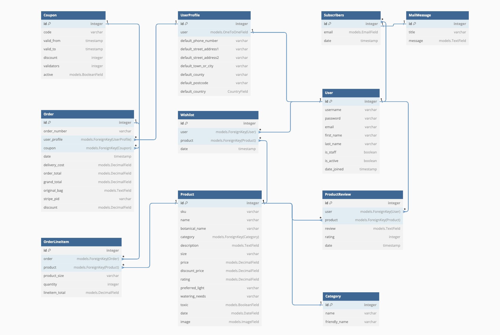


# Manual Testing
#### 1. **User Authentication:**

   - **User Registration:**
     1. Navigate to the [Sign Up](https://puravida-b1d8a70ff589.herokuapp.com/accounts/signup/) page.
     2. Fill in valid details for email, username, password, and password confirmation.
     3. Click the submit button.
     4. **Expected:** User is redirected to the login page.
     5. **Actual:** User is redirected to the login page.

   - **User Login:**
     1. Navigate to the [Login](https://puravida-b1d8a70ff589.herokuapp.com/accounts/login/) page.
     2. Enter valid login credentials.
     3. Click the login button.
     4. **Expected:** User is logged in and redirected to the home page.
     5. **Actual:** User is logged in and redirected to the home page.

   - **Password Reset:**
     1. Navigate to the [Password Reset](https://puravida-b1d8a70ff589.herokuapp.com/accounts/password/reset/) page.
     2. Enter a valid email address.
     3. Click the reset password button.
     4. **Expected:** User receives a password reset email.
     5. **Actual:** [Provide feedback on the actual outcome.]

#### 2. **Shopping Bag:**

   - **View Shopping Bag:**
     1. Navigate to the [Shopping Bag](https://puravida-b1d8a70ff589.herokuapp.com/bag/) page.
     2. Verify that the products added to the bag are displayed.
     3. Check the total price and quantity.
     4. **Expected:** Shopping bag displays correct products, total price, and quantity.
     5. **Actual:** Shopping bag displays correct products, total price, and quantity.

   - **Update Shopping Bag:**
     1. Change the quantity of a product.
     3. Verify that the changes are reflected in the shopping bag.
     4. **Expected:** Shopping bag is updated with the new quantity.
     5. **Actual:** Shopping bag is updated with the new quantity.

   - **Remove Items from Shopping Bag:**
     1. Remove a product from the shopping bag.
     2. Verify that the product is no longer in the shopping bag.
     3. **Expected:** Product is removed from the shopping bag.
     4. **Actual:** Product is removed from the shopping bag.

#### 3. **Product Listing and Details:**

   - **View All Products:**
     1. Navigate to [All Products](https://puravida-b1d8a70ff589.herokuapp.com/products/).
     2. Ensure all products are displayed.
     3. **Expected:** All products are visible on the page.
     4. **Actual:** All products are visible on the page.

   - **Filter Products:**
     1. Use various filters (category, price, water needs, light requirements, toxicity) to narrow down product listings.
     2. Verify that the displayed products match the selected filters.
     3. **Expected:** Products displayed match the selected filters.
     4. **Actual:** Products displayed match the selected filters.

   - **View Individual Product:**
     1. Click on an individual product.
     2. Verify that the product details, including images, description, and price, are displayed.
     3. **Expected:** Product details are correctly displayed.
     4. **Actual:** Product details are correctly displayed.

#### 4. **User Account Management:**

   - **View User Profile:**
     1. Navigate to the user profile page.
     2. Verify that user information is displayed correctly.
     3. **Expected:** User profile displays accurate information.
     4. **Actual:** User profile displays accurate information.

   - **Update User Profile:**
     1. Edit user profile information.
     2. Save the changes.
     3. Verify that the changes are reflected in the user profile.
     4. **Expected:** User profile is updated with new information.
     5. **Actual:** User profile is updated with new information.

   - **Change Password:**
     1. Navigate to the change password page.
     2. Enter the current password and a new password.
     3. Save the changes.
     4. **Expected:** Password is updated successfully.
     5. **Actual:** Password is updated successfully.

#### 5. **Checkout Process:**

   - **Add Products to Cart:**
     1. Add products to the shopping bag.
     2. Verify that the products are correctly added.
     3. **Expected:** Products are added to the shopping bag.


     4. **Actual:** Products are added to the shopping bag.

   - **Proceed to Checkout:**
     1. Initiate the checkout process.
     2. Provide shipping and payment information.
     3. Complete the checkout process.
     4. **Expected:** Order is placed successfully.
     5. **Actual:** Order is placed successfully.

#### 6. **Search Functionality:**

   - **Search for Products:**
     1. Use the search bar to search for products.
     2. Verify that relevant products are displayed.
     3. **Expected:** Relevant products are displayed in the search results.
     4. **Actual:** Relevant products are displayed in the search results.

#### 7. **Responsive Design:**

   - **Test on Different Devices:**
     1. Open the website on various devices (desktop, tablet, mobile).
     2. Ensure that the website is responsive and displays correctly.
     3. **Expected:** Website is responsive on all devices.
     4. **Actual:** Website is responsive on all devices.

#### 8. **Links and Navigation:**

   - **Test All Navigation Links:**
     1. Click on all navigation links.
     2. Verify that each link leads to the correct page.
     3. **Expected:** All navigation links lead to the correct pages.
     4. **Actual:** All navigation links lead to the correct pages.


# Deployment

### Step 1: Heroku Account Setup

1. **Navigate to Heroku:**
   - Visit [Heroku](https://www.heroku.com/) and create an account.

2. **Create a New App:**
   - Click the "New" button in the top right corner.
   - Select "Create new app."
   - Enter your desired app name.
   - Choose a region and click "Create app."

### Step 2: ElephantSQL Account Setup

3. **Navigate to ElephantSQL:**
   - Visit [ElephantSQL](https://www.elephantsql.com/) and create an account.

4. **Create a Database Instance:**
   - Click on "Create New Instance."
   - Choose the "Tiny Turtle" plan.
   - Select the EU region.
   - Click "Review" and then "Create Instance."

### Step 3: AWS Setup

5. **AWS S3 Configuration:**
   - Create an AWS account if you don't have one.
   - Set up an S3 bucket to store static and media files.
   - Obtain AWS access key and secret key.

### Step 4: Configure Project Settings

6. **Configure Settings for AWS S3:**
   - Update your `settings.py` file with AWS S3 configurations.
     ```python
     # settings.py
     AWS_ACCESS_KEY_ID = 'aws-access-key-id'
     AWS_SECRET_ACCESS_KEY = 'aws-secret-access-key'
     AWS_STORAGE_BUCKET_NAME = 's3-bucket-name'
     AWS_S3_REGION_NAME = 'region'
     ```


### Step 5: Heroku Configuration

7. **Add Config Vars on Heroku:**
   - In Heroku, go to the "Settings" tab and click "Reveal Config Vars."
   - Add the following config vars:
     - SECRET_KEY: (secret key)
     - DATABASE_URL: (database url)
     - AWS_ACCESS_KEY_ID: (AWS access key)
     - AWS_SECRET_ACCESS_KEY: (AWS secret key)


### Step 6: Deploy to Heroku

8. **Heroku Deploy Tab:**
   - Click the "Deploy" tab in Heroku.

9. **Connect to GitHub:**
    - Scroll down to "Connect to GitHub" and sign in/authorize when prompted.

10. **Manual Deploy:**
    - In the search box, find the repository you want to deploy and click "Connect."
    - Scroll down to "Manual deploy" and choose the main branch.
    - Click "Deploy."

### Step 7: Verify Deployment

111. **Verify Deployment:**
    - Your app should now be deployed.
    - The live link can be found [here](https://puravida-b1d8a70ff589.herokuapp.com/).

### Credits

- All pictures were obtained from [Freepik](https://www.freepik.com/).

- Youtube tutorials of: 
    * [Desphixs](https://www.youtube.com/@desphixs)
    * [KenBroTech](https://www.youtube.com/@kenbrotech)
